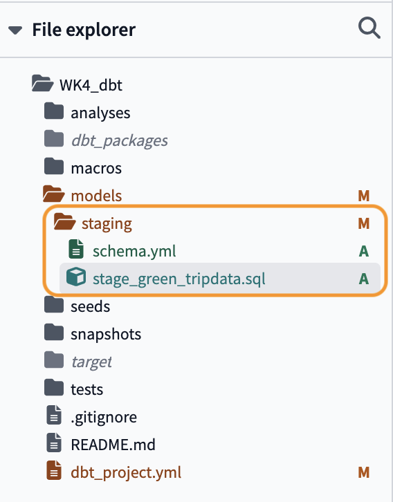
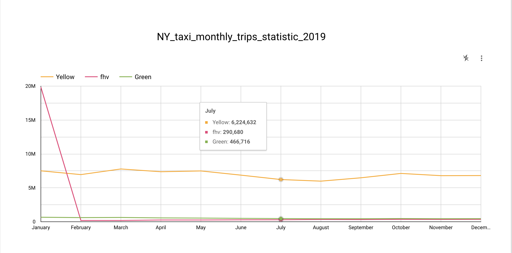

# dbt

## Target: Using dbt to Transform nyc taxi data(yellow&green taxi data during 2019&2020)

**Steps:**

**1.Setup dbt cloud & data preparation**

**2.dbt config**
Including dbt sources & seeds,macros,vars,packages

### Setup dbt cloud & data preparation

#### 1. Data preparation

##### Download required parquet files from https://www.nyc.gov/site/tlc/about/tlc-trip-record-data.page

##### Upload related files to your GCP bucket


##### Switch to BigQuery, run below sql to create tables for the history data

Firstly,create new dataset:ny_taxi, then run below SQL

```
create or replace external table ny_taxi.green_tripdata_external
options(
  format = 'PARQUET',
  uris = ['gs://mage-demo-mansisun007654321/green/*.parquet']
);
```
```
create or replace external table ny_taxi.yellow_tripdata_external
options(
  format = 'PARQUET',
  uris = ['gs://mage-demo-mansisun007654321/yellow/*.parquet']
);
```

#### 2. Create a free dbt developer account

##### upload your GCP service account json file

##### link to Github repo

##### click dbt init button to initialize your project &  dbt will also request you to create a new branch for your repo

### DBT basic config

#### Config Schema & model scripts

After "dbt init", dbt structure will be look like below:


We could create a folder named "staging" under models folder to store our model in staging phase, the schema.yml under it contains information regarding BigQuery connection; and the stage_green_tripdata.sql is the SQL we used to create the model.

```
version: 2

sources:
  - name: staging
    database: golden-sandbox-411418
    schema: ny_taxi
    tables:
      - name: green_tripdata_external
      - name: yellow_tripdata_external
```

```
{{config(materialized='view')}}

select * from {{source('staging','green_tripdata_external')}}
limit 100
```

#### Write customized macro under macros folder

DBT macros are like functions in Python, some simple syntax as follows:

{# #} comment


code
	define

{{ }} call macro

Here is the code to get the payment type description
```
{#
	This macro returns the payment type description info.
#}


case {{payment_type}}
	when 1 then 'Credit card'
	when 2 then 'Cash'
	when 3 then 'No charge'
	when 4 then 'Dispute'
	when 5 then 'Unknown'
	when 6 then 'voided trip'
end
 
```

If we want to use other macros, we could create a "packages.yml" file under the root directory, past the package information, then run "dbt deps" to download related packages.

```
packages:
  - package: dbt-labs/dbt_utils
    version: 0.8.0
```


We could use the macro in our SQL:

```
{{dbt_utils.surrogate_key(['VendorID','lpep_pickup_datetime'])}} as tripid,
```

We could also add variables to define values that should be use across the project, for example,below code means : By default, the compiled model will ending with "limit 100". 

```

limit 100

```

But if we run below command, the model will not contain "limit 100"
```
dbt run --select stage_green_tripdata --vars '{"is_test_run": false}'
```


###Homework

As for the homework. Firstly, we need load the data from GCS to BigQuery

**Remember to use the csv the bootcamp provided, or we will waste time dealing with inconsistency data type with the parquet files**
```
create or replace external table ny_taxi.fhv_2019 
options( 
format = 'CSV', 
uris = ['gs://mage-demo-mansisun007654321/fhv/*.csv'] );
```

Secondly, we could create the fact_fhv_trips model, which inner joined with table dim_zones to filter out unknown borough

**Check file models/core/fact_fhv_trips.sql**

Thirdly, we could union yellow&green trip data with fhv data to get ready for the data visualization

**Check file models/core/fact_monthly_data.sql**

In the end, we got our data visualized in google looker studio
 
