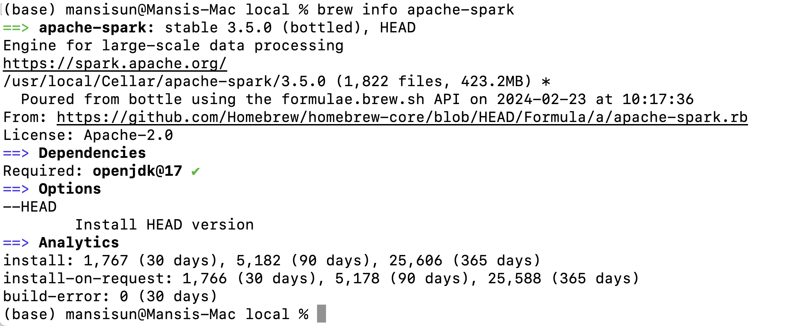
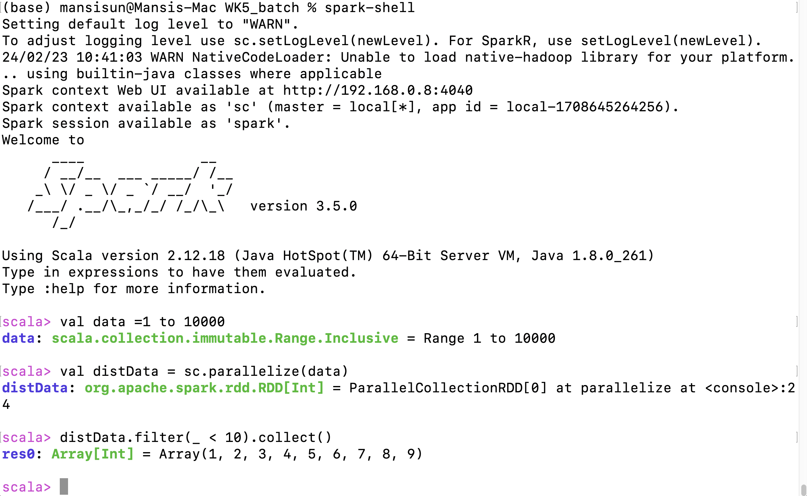

##Pyspark learning notes

###Pyspark installation in GCP VM

####Install Spark on macos

1. Install scala
brew install scala@2.13

2. Install spark
brew install apache-spark

3. Add environment variables

Add the following environment variables to your .bash_profile or .zshrc. Replace the path to SPARK_HOME to the path on your own host. Run brew info apache-spark to get this.

```
export SPARK_HOME=/usr/local/Cellar/apache-spark/3.5.0/libexec
export PATH="$SPARK_HOME/bin/:$PATH"
```

4. Run below command to test spark

```
val data = 1 to 10000
val distData = sc.parallelize(data)
distData.filter(_ < 10).collect()
```
