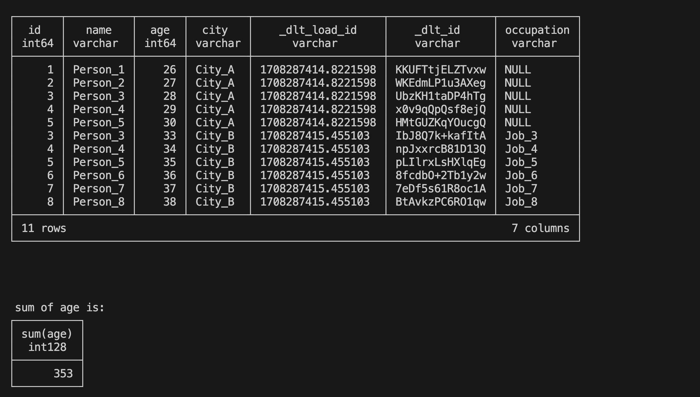
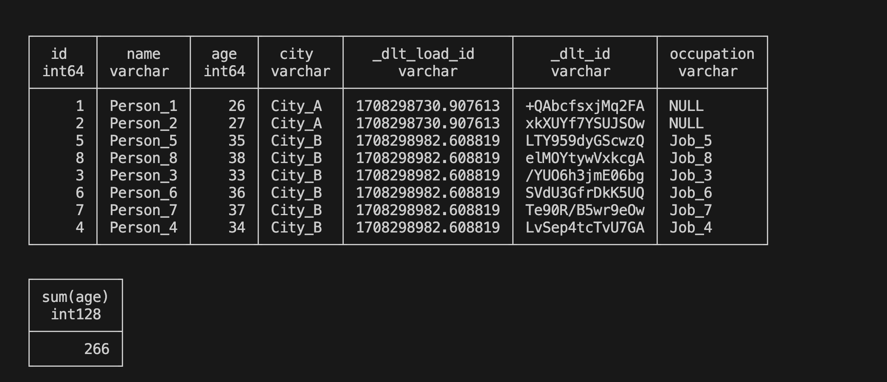

#Homework code
## 1. Use a generator

Remember the concept of generator? Let's practice using them to futher our understanding of how they work.

Let's define a generator and then run it as practice.

**Answer the following questions:**

- **Question 1: What is the sum of the outputs of the generator for limit = 5?**
```
def square_root_generator(limit):
    n=1
    while n<=limit:
        yield n**0.5
        n +=1

limit=5
generator=square_root_generator(limit)
total=sum(generator)
print(total)
```
- **Question 2: What is the 13th number yielded**
```
from itertools import islice

def square_root_generator(limit):
    n=1
    while n<=limit:
        yield n**0.5
        n +=1

limit=13
generator=square_root_generator(limit)

thirteenth_result=next(islice(generator,12,13))
print(thirteenth_result)
```
- **Qeustion3**
Below you have 2 generators. You will be tasked to load them to duckdb and answer some questions from the data
1.Load the first generator and calculate the sum of ages of all people. Make sure to only load it once.
2.Append the second generator to the same table as the first.
3.After correctly appending the data, calculate the sum of all ages of people.

****Load the data
```
import dlt

def people_1():
    for i in range(1, 6):
        yield {"ID": i, "Name": f"Person_{i}", "Age": 25 + i, "City": "City_A"}

def people_2():
    for i in range(3, 9):
        yield {"ID": i, "Name": f"Person_{i}", "Age": 30 + i, "City": "City_B", "Occupation": f"Job_{i}"}

generators_pipeline=dlt.pipeline(destination='duckdb',dataset_name='generators')
info=generators_pipeline.run(people_1(),
							 table_name='personcount2',
							 write_disposition='replace')

info=generators_pipeline.run(people_2(),
							 table_name='personcount2',
							 write_disposition='append')
print(info)
```
****Check the data
```
import duckdb

conn=duckdb.connect(database='dlt_exercise.duckdb')
conn.sql("SET search_path = 'generators'")
print(conn.sql("show tables"))

print("\n\n\n personcount2 table below:")
print(conn.sql("select * from personcount2"))
print("\n\n\n sum of age is:")
sumage=conn.sql("select sum(age) from personcount2")
print(sumage)
```


-  **Question4**

Re-use the generators from Exercise 2.

A table's primary key needs to be created from the start, so load your data to a new table with primary key ID.

Load your first generator first, and then load the second one with merge. Since they have overlapping IDs, some of the records from the first load should be replaced by the ones from the second load.
****Load part1 data
```
import dlt
def people_1():
    for i in range(1, 6):
        yield {"ID": i, "Name": f"Person_{i}", "Age": 25 + i, "City": "City_A"}
pipeline=dlt.pipeline(destination='duckdb',dataset_name='persons')
info=pipeline.run(
    people_1(),
    table_name='sum_age',
    write_disposition='replace'
)
print(info)    
```
****Merge part2 with primary key
```
import dlt
def people_2():
    for i in range(3, 9):
        yield {"ID": i, "Name": f"Person_{i}", "Age": 30 + i, "City": "City_B", "Occupation": f"Job_{i}"}
pipeline=dlt.pipeline(destination='duckdb',dataset_name='persons')
info=pipeline.run(
    people_2(),
    table_name='sum_age',
    write_disposition='merge',
    primary_key='ID'
)
print(info)
```
****Check data
```
import duckdb
conn=duckdb.connect(database='dlt_q4step1.duckdb')
conn.sql("SET search_path='persons'")
print(conn.sql("show tables"))
print("\n\n\n")
print(conn.sql("select count(*) from sum_age"))
print("\n\n\n")
print(conn.sql("select * from sum_age"))
print(conn.sql("select sum(age) from sum_age"))
```
