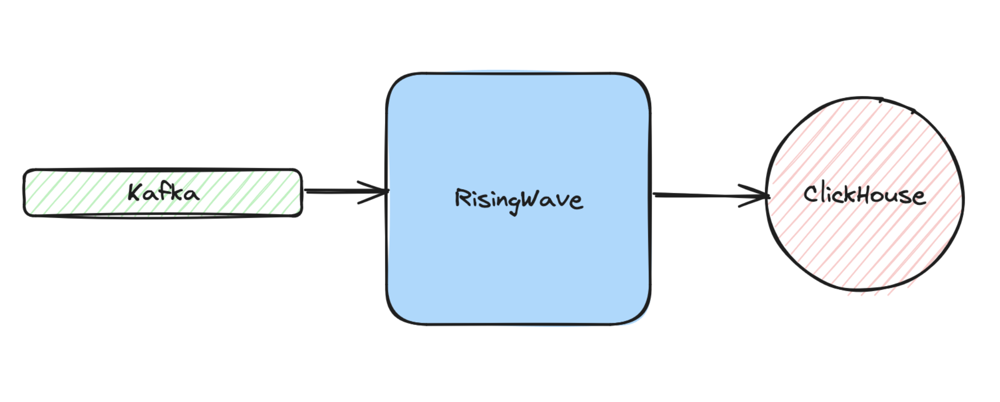

## RisingWave workshop learning notes


Project structure:



Check out this well prepared workshop resouce from:

```bash
git clone git@github.com:risingwavelabs/risingwave-data-talks-workshop-2024-03-04.git
```

Tutorial available from https://www.youtube.com/watch?v=L2BHFnZ6XjE


### Key takeaway 

- Gain practical experience in streaming processing

- Enhance your proficiency in SQL, focusing on dynamic filters and window functions

- Explore insights into database internals

### Following the workshop step by step

> Note: If you wanna run this on your computer,make sure you have enough disk space (>15GB), and with postgresql & docker installed on your mac.

#### 1.Setup the environment
```bash
# Check version of psql
psql --version
source commands.sh

# Start the RW cluster
start-cluster

# Setup python
python3 -m venv .venv
source .venv/bin/activate
pip install -r requirements.txt
```
> Note: Why using source here, instead of "./commands.sh"? The reason is to make the environment variables effect on current session. If we run "./commands.sh", it will create a new session and run the scripts then exit the new session. So if we run "echo $PGHOST", will get a blank result.

#### 2.Simulate the real-time data
```bash
stream-kafka
```
> Note: We could find below code from "commands.sh"
```bash
# Seed trip data from the parquet file
stream-kafka() {
        ./seed_kafka.py update
}
```

The script will convert the date in "data/yellow_tripdata_2022-01.parquet" file into today's date, and sending the data continually.


Open another terminal to create the trip_data table:
```bash
source commands.sh
psql -f risingwave-sql/table/trip_data.sql
psql -c "show tables;"
```

#### 3.Validate the ingested data


#### 4.Create materialized view for later on display

##### MV1:Top 10 busiest zones in last 1 minutes
```sql
create materialized view last_1min_top10_busiest_zones as
select 
    zone as pickup_zone,
    count(*) as pickup_counts
from taxi_zone
    join trip_data
    on taxi_zone.location_id=trip_data.pulocationid
where
    trip_data.tpep_pickup_datetime > now() - interval '1 minute'
group by zone
order by pickup_counts desc
limit 10;
```

##### MV2:Longest trips in last 5 minutes
```sql
create materialized view last_5mins_longest_trips as
select 
    tpep_pickup_datetime,
    tpep_dropoff_datetime,
    pickupzone.zone as pickup_zone,
    dropoffzone.zone as dropoff_zone,
    trip_distance
from trip_data
    join
        taxi_zone as pickupzone on pickupzone.location_id=trip_data.pulocationid
    join
        taxi_zone as dropoffzone on dropoffzone.location_id=trip_data.dolocationid
where tpep_pickup_datetime > now()- interval '5 minute'
order by trip_distance desc
limit 10;
```
#### 5.Check the dashboard
If it's a new session, remember to run below commands

> Remember to change the materialized view name in server.py

```bash
source commands.sh
# Setup python
python3 -m venv .venv
source .venv/bin/activate
pip install -r requirements.txt

# Start Server
./server.py

open index.html
```
#### 6.Sink data to Clickhouse

##### Create the materialized view to get the relationship between average fare amount and total rides.

```sql
CREATE MATERIALIZED VIEW avg_fare_amt AS
SELECT
    avg(fare_amount) AS avg_fare_amount_per_min,
    count(*) AS num_rides_per_min,
    window_start,
    window_end
FROM
    TUMBLE(trip_data, tpep_pickup_datetime, INTERVAL '1' MINUTE)
GROUP BY
    window_start, window_end
ORDER BY
    num_rides_per_min ASC;
```

##### Open the Clickhouse client

```bash
clickhouse-client-term
```

##### Create a Clickhouse table to store the data from the materialized views.

```sql
CREATE TABLE avg_fare_amt(
    avg_fare_amount_per_min numeric,
    num_rides_per_min Int64,
) ENGINE = ReplacingMergeTree
PRIMARY KEY (avg_fare_amount_per_min, num_rides_per_min);
```

##### In psql, create a Clickhouse sink to sink the data from the materialized views to the Clickhouse table

```sql
CREATE SINK IF NOT EXISTS avg_fare_amt_sink AS SELECT avg_fare_amount_per_min, num_rides_per_min FROM avg_fare_amt
WITH (
    connector = 'clickhouse',
    type = 'append-only',
    clickhouse.url = 'http://clickhouse:8123',
    clickhouse.user = '',
    clickhouse.password = '',
    clickhouse.database = 'default',
    clickhouse.table='avg_fare_amt',
    force_append_only = 'true'
);
```

##### Now,in Clickhouse, check the sinked data.

```sql
select max(avg_fare_amount_per_min) from avg_fare_amt;
```